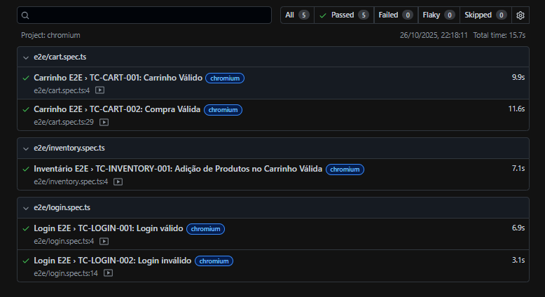

# Documentação do Projeto de Testes Automatizados para Saucedemo

> Imagem capturada do relatório do Playwright

Índice
1. [Desenvolvedora](#desenvolvedora)
2. [Tecnologias utilizadas](#1-tecnologias-utilizadas)
3. [Configuração para rodar o projeto](#2-configuração-para-rodar-o-projeto)
4. [Outras documentações](#7-outras-documentações)
5. [Agradecimentos](#agradecimentos)

## Desenvolvedora

<table>
  <tr>
    <td align="center"><a href="https://github.com/AlineEspindola"><br /><sub><b>Aline Espindola</b></sub></a><br /><a href="#" title="Code">💻🎨</a></td>
  </tr>
</table>

---

## 1. Tecnologias utilizadas

  
  
  
  


---

## 2. Configuração para rodar o projeto

> Antes de iniciar, **certifique-se de ter o Node instalado**.  

1. Clonar o repositório:  
```bash
git clone https://github.com/tagplus-qa-lab/qa-junior-playwright-frontend.git
cd qa-junior-playwright-frontend
```

2. Copiar o arquivo de exemplo de variáveis de ambiente:  
```bash
cp .env.example .env
```
> Esse arquivo já vem configurado com o link padrão do site Saucedemo, utilizado nos testes automatizados.
> Caso queira validar outro ambiente (como o de homologação ou produção), basta editar o valor da variável BASE_URL dentro do arquivo .env e inserir o novo endereço.

3. Instalar as dependências do projeto:  
```bash
npm i
```

4. Instalar os navegadores necessários do Playwright:  
```bash
npx playwright install
```

5. Executar todos os testes:  
```bash
npm test
```

6. Ver relatório de todos os testes:  
```bash
npx playwright show-report
```

## 7. Outras Documentações

No projeto, algumas documentações adicionais estão disponíveis para referência e melhor organização dos testes e funcionalidades.  

### Testes E2E

- Toda a documentação referente aos **testes automatizados (E2E)** está localizada na pasta `/docs`.

---

## Agradecimentos

Gostaria de agradecer a **TagPlus** pela oportunidade de participar deste processo seletivo.  
Agradeço também a todos que irão avaliar o projeto, revisar código e fornecer feedbacks valiosos.

Foi uma experiência enriquecedora aplicar boas práticas de desenvolvimento e testes automatizados neste projeto.


